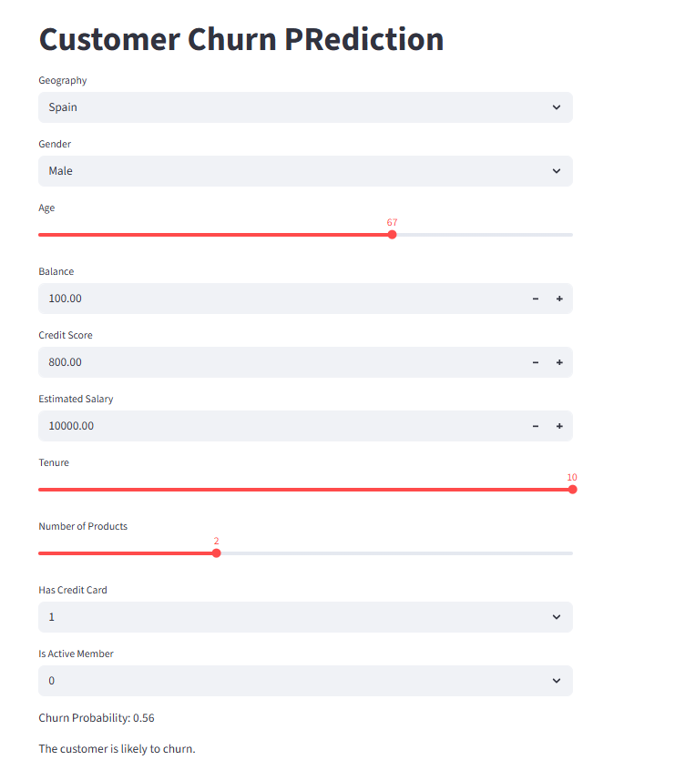

# Customer Churn Prediction - Bank



This project predicts customer churn for a bank using an Artificial Neural Network (ANN) built with TensorFlow and scikit-learn. The solution includes data preprocessing, model training, and a Streamlit web app for user interaction.

## Project Structure

- `Churn_Modelling.csv`: Dataset used for training and testing.
- `experiments.ipynb`: Jupyter notebook for data exploration, preprocessing, and model development.
- `app.py`: Streamlit web application for making predictions.
- `requirements.txt`: List of required Python packages.
- `venvbankchurn/`: Python virtual environment (should not be committed to git).
- `.gitignore`: Specifies files and folders to be ignored by git.
- `*.pkl`: Saved encoders and scaler objects.
- `model.h5`: Trained ANN model.

## Prerequisites

- Python 3.11 or compatible version
- pip (Python package manager)
- (Recommended) Virtual environment such as `venv` or `conda`

## Installation

1. **Clone the repository:**
   ```sh
   git clone <repository-url>
   cd CustomerChurnBank
   ```

````
2. **Create and activate a virtual environment:**
   ```sh
python -m venv venvbankchurn
# On Windows:
venvbankchurn\Scripts\activate
# On macOS/Linux:
source venvbankchurn/bin/activate
````

3. **Install dependencies:**
   ```sh
   pip install --upgrade pip
   pip install -r requirements.txt
   ```

````

## Usage
### Jupyter Notebook
- Open `experiments.ipynb` in VS Code or Jupyter Lab/Notebook.
- Run the cells sequentially to preprocess data, train the model, and save encoders/scaler/model files.

### Streamlit App
- Run the web app with:
   ```sh
streamlit run app.py
````

- Open the provided local URL in your browser to interact with the model.

## Notes

- The `.gitignore` file excludes data, model, and environment files from version control.
- If you install new packages in the notebook, restart the kernel to avoid import errors.
- Ensure all `.pkl` and `.h5` files are present for the app to work correctly.

## License

This project is for educational purposes.
